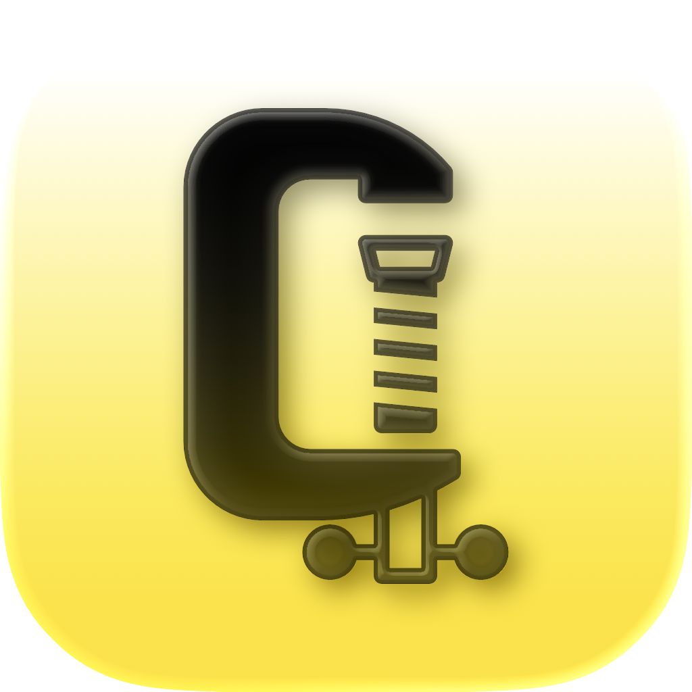
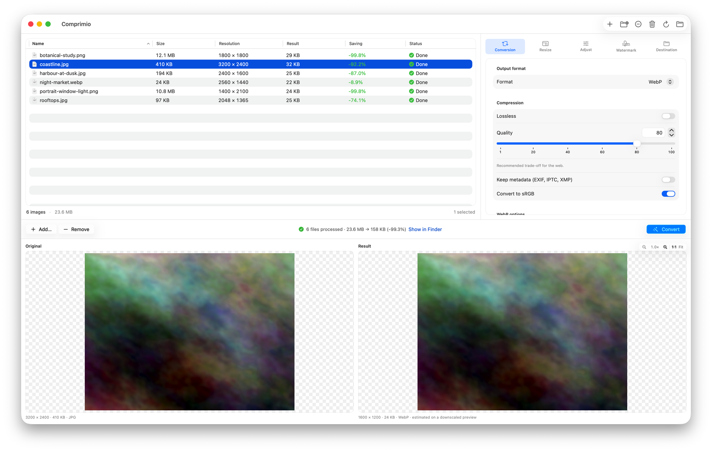

<p align="center">
  
</p>

# Comprimio

A native macOS app for converting, compressing and resizing images in batches.
Drop in a folder, set the options once, watch the previews, convert everything.

ImageMagick and its coders ship **inside the app**. There is nothing to install,
no Homebrew, no command line, and no network access at any point — your images
never leave your Mac.



---

## Features

### Batch conversion

- **Drag and drop** files or entire folders onto the window, add them from the
  toolbar, or send them from the Finder with *Open With*. Folders are scanned
  recursively and non-images are skipped.
- **Parallel conversion** across up to 8 lanes, one per core minus one. A new
  file starts the moment a lane frees up rather than in fixed batches.
- **Live progress per file**, read from ImageMagick itself, plus an overall bar
  and the running count.
- **Cancel at any time.** Cancelling actually terminates the running
  subprocesses instead of leaving them grinding away in the background.
- **A summary you can act on**: original size, output size and the percentage
  saved, per file and for the whole run. Every column sorts.
- **Reveal in Finder** for everything the run produced.

### Live preview

- **Original and result side by side**, with zoom and panning **synchronised
  between the two panes** so you are always comparing the same pixels.
- A fast preview updates as you change settings, with an **estimated output
  size**; zoom in and the pane switches to the real, full-resolution render.
- The preview is regenerated automatically whenever a setting changes.

### Convert

- **125 output formats**, grouped into categories, with **Keep original** if you
  only want to compress or resize without changing format.
- The menu is **built from the ImageMagick actually inside the app**: a format
  the bundled build cannot write is never offered.
- **Quality** slider, with the ceiling each format really supports.
- **Lossless mode** for WebP, JPEG XL and the other formats that have one.
- **Metadata**: keep or strip EXIF, IPTC and XMP.
- **Convert to sRGB**, so colours look right in browsers.
- **Progressive JPEG** and **chroma subsampling** (4:4:4, 4:2:2, 4:2:0, or left
  to the encoder).
- **PNG compression level** and 8-bit palette mode.
- **WebP method** and **JPEG XL effort**, trading encoding time for file size.
- **Flatten transparency** onto a colour you pick, for formats without an alpha
  channel.

### Resize

- **Percentage**, **fit within a box**, **fixed width**, **fixed height**,
  **exact size**, or **fill and crop**.
- **Never enlarge**, so smaller originals are left alone.
- **Resampling filter**: Lanczos, Mitchell, Catrom, Triangle or Point.
- **Set the DPI** written into the file.

### Adjust

- **Auto-orient** from the EXIF orientation tag.
- **Rotate** 90° either way or 180°, **flip** horizontally or vertically.
- **Brightness**, **contrast** and **saturation**.
- **Sharpen** and **blur**.
- **Grayscale**.

### Watermark

- Overlay a **logo image** or a **text** watermark on every image in the batch.
- **Nine positions**, with a margin expressed as a percentage of the image, so
  it lands in the same place whatever the size.
- **Opacity**, **scale**, and **rotation** in degrees.
- **Tiling** across the whole image, with an adjustable gap.
- For text: **font family**, **colour**, and an **outline** for legibility over
  busy pictures.

### Destination

- Write into a **subfolder next to the original**, into the **same folder**, or
  into a **folder of your choice**.
- **Prefix and suffix** for the file name, with a live example of the result.
- **Overwrite** deliberately, or let Comprimio add `-1`, `-2` and so on.

### Everywhere else

- **English, Italian, German, Spanish and French.**
- Native SwiftUI, with **Liquid Glass** on macOS 26 and translucent materials
  before it.
- **Sandboxed.** Comprimio only ever sees the files and folders you hand it.

---

## Supported formats

### Reading

Comprimio accepts **155 file extensions** — everything the bundled ImageMagick
can decode.

That includes formats it deliberately **cannot write back**, because writing
them would need tools that are not in the bundle: camera raw files, the
exchange formats of other editors, and vector or animated formats that get
rasterised on the way in.

```
3fr  apng arw  cr2  cr3  crw  cut  dcm  dcr  dicom dng  erf  fff  iiq
jbg  jbig jnx  k25  kdc  mac  mdc  mef  mos  mpo   mrw  msvg mvg  nef
nrw  orf  pcd  pcds pef  pes  pix  pwp  raf  raw   rla  rle  rmf  rw2
rwl  scr  sct  sfw  sr2  srf  srw  sti  svg  svgz  tim  tm2  x3f  xcf
xps
```

Everything else in the catalogue below can be both read and written, along with
the usual aliases (`.jpeg`, `.tif`, `.j2c`, `.jpf`, `.heifs`, `.avifs` and so
on).

### Writing

Comprimio writes **125 formats**. Quality, transparency and lossless
columns say which options the panel offers for that format.

#### Web and everyday use

| Format | Extension | Quality | Alpha | Lossless |
| --- | --- | :-: | :-: | :-: |
| JPEG | `.jpg` | • |  |  |
| PNG | `.png` |  | • |  |
| WebP | `.webp` | • | • | • |
| AVIF | `.avif` | • | • |  |
| HEIC | `.heic` | • | • |  |
| TIFF | `.tiff` | • | • |  |
| GIF | `.gif` |  | • |  |
| BMP | `.bmp` |  |  |  |
| JPEG XL | `.jxl` | • | • | • |
| HEIF | `.heif` | • | • |  |

#### Variants of the common formats

| Format | Extension | Quality | Alpha | Lossless |
| --- | --- | :-: | :-: | :-: |
| 8-bit PNG (palette) | `.png` |  | • |  |
| 24-bit PNG | `.png` |  | • |  |
| 32-bit PNG (RGBA) | `.png` |  | • |  |
| 48-bit PNG | `.png` |  | • |  |
| 64-bit PNG (RGBA) | `.png` |  | • |  |
| PNG (inherits depth and type) | `.png` |  | • |  |
| Progressive JPEG | `.jpg` | • |  |  |
| BMP version 2 | `.bmp` |  |  |  |
| BMP version 3 | `.bmp` |  |  |  |
| GIF 87a | `.gif` |  |  |  |
| BigTIFF (64-bit TIFF) | `.tif` | • | • |  |
| Pyramidal TIFF | `.ptif` | • | • |  |

#### Photography, HDR and cinema

| Format | Extension | Quality | Alpha | Lossless |
| --- | --- | :-: | :-: | :-: |
| JPEG 2000 | `.jp2` | • | • |  |
| Uncompressed JPEG 2000 (PGX) | `.pgx` |  |  |  |
| OpenEXR | `.exr` |  | • |  |
| Radiance HDR | `.hdr` |  |  |  |
| Portable Float Map | `.pfm` |  |  |  |
| Portable Half Float Map | `.phm` |  |  |  |
| FilmLight FL32 | `.fl32` |  |  |  |
| DPX (SMPTE 268M) | `.dpx` |  |  |  |
| Cineon | `.cin` |  |  |  |
| Stereoscopic JPEG (JPS) | `.jps` | • |  |  |
| JNG (JPEG Network Graphics) | `.jng` | • | • |  |
| MNG (multiple-image PNG) | `.mng` |  | • |  |

#### Graphics and editing

| Format | Extension | Quality | Alpha | Lossless |
| --- | --- | :-: | :-: | :-: |
| Photoshop (PSD) | `.psd` |  | • |  |
| Photoshop Large Document (PSB) | `.psb` |  | • |  |
| MIFF (Magick Image File) | `.miff` |  | • |  |
| MPC (Magick Pixel Cache) | `.mpc` |  | • |  |
| VIPS | `.v` |  | • |  |
| Targa (TGA) | `.tga` |  | • |  |
| PCX (ZSoft Paintbrush) | `.pcx` |  |  |  |
| DCX (multi-page PCX) | `.dcx` |  |  |  |
| DDS (DirectDraw Surface) | `.dds` | • | • |  |
| DDS with DXT1 compression | `.dds` |  |  |  |
| DDS with DXT5 compression | `.dds` |  | • |  |
| QOI (Quite OK Image) | `.qoi` |  | • |  |
| Farbfeld | `.ff` |  | • |  |
| SGI (Irix RGB) | `.sgi` |  | • |  |
| Sun Rasterfile | `.ras` |  |  |  |
| PICT (QuickDraw) | `.pict` |  | • |  |
| WordPerfect Graphics | `.wpg` |  |  |  |
| Palm Pixmap | `.palm` |  | • |  |
| Palm Database (PDB) | `.pdb` |  |  |  |
| Aseprite | `.ase` |  | • |  |
| AAI Dune | `.aai` |  | • |  |
| AVS X | `.avs` |  | • |  |
| PFS: 1st Publisher (ART) | `.art` |  |  |  |
| MATLAB (level 5) | `.mat` |  | • |  |
| Khoros VIFF | `.viff` |  | • |  |
| Khoros XV | `.xv` |  | • |  |
| IPL Image Sequence | `.ipl` |  | • |  |
| MTV Raytracing | `.mtv` |  |  |  |
| CALS Type 1 | `.cals` |  |  |  |
| Slow Scan TeleVision (HRZ) | `.hrz` |  |  |  |
| Simple File Format (SF3) | `.sf3` |  | • |  |
| LEGO Mindstorms EV3 (RGF) | `.rgf` |  |  |  |
| Cisco IP Phone | `.cip` |  |  |  |
| On-the-air bitmap (OTB) | `.otb` |  |  |  |

#### Documents and vector

| Format | Extension | Quality | Alpha | Lossless |
| --- | --- | :-: | :-: | :-: |
| PDF | `.pdf` | • | • |  |
| PDF/A | `.pdf` | • | • |  |
| Encapsulated PDF (EPDF) | `.epdf` | • |  |  |
| PostScript | `.ps` | • |  |  |
| PostScript level 2 | `.ps` | • |  |  |
| PostScript level 3 | `.ps` | • |  |  |
| Encapsulated PostScript (EPS) | `.eps` | • |  |  |
| EPS level 2 | `.eps` | • |  |  |
| EPS level 3 | `.eps` | • |  |  |
| EPS Interchange (EPI) | `.epi` | • |  |  |
| EPS with TIFF preview | `.ept` | • |  |  |
| Adobe Illustrator (AI) | `.ai` | • |  |  |
| PCL (HP printers) | `.pcl` |  |  |  |

#### Icons and system bitmaps

| Format | Extension | Quality | Alpha | Lossless |
| --- | --- | :-: | :-: | :-: |
| ICO (Windows icon) | `.ico` |  | • |  |
| CUR (Windows cursor) | `.cur` |  | • |  |
| X BitMap (XBM) | `.xbm` |  |  |  |
| X PixMap (XPM) | `.xpm` |  | • |  |
| Wireless Bitmap (WBMP) | `.wbmp` |  |  |  |
| Personal Icon (PICON) | `.picon` |  | • |  |

#### Netpbm and fax

| Format | Extension | Quality | Alpha | Lossless |
| --- | --- | :-: | :-: | :-: |
| PNM (Portable Anymap) | `.pnm` |  |  |  |
| PBM (black and white) | `.pbm` |  |  |  |
| PGM (grayscale) | `.pgm` |  |  |  |
| PPM (color) | `.ppm` |  |  |  |
| PAM | `.pam` |  | • |  |
| Raw bi-level bitmap | `.mono` |  |  |  |
| Group 3 fax | `.fax` |  |  |  |
| Group 3 | `.g3` |  |  |  |
| Group 4 | `.g4` |  |  |  |
| Raw CCITT Group 4 | `.g4` |  |  |  |
| Color map (MAP) | `.map` |  |  |  |

#### Raw pixel dumps

> Headerless dumps of pixel data. Available as output only — Comprimio will not read them back, because such a file carries no dimensions of its own.

| Format | Extension | Quality | Alpha | Lossless |
| --- | --- | :-: | :-: | :-: |
| Raw RGB | `.rgb` |  |  |  |
| Raw RGBA | `.rgba` |  | • |  |
| Raw RGBO (opacity) | `.rgbo` |  | • |  |
| Raw BGR | `.bgr` |  |  |  |
| Raw BGRA | `.bgra` |  | • |  |
| Raw BGRO (opacity) | `.bgro` |  | • |  |
| Raw CMYK | `.cmyk` |  |  |  |
| Raw CMYKA | `.cmyka` |  | • |  |
| Raw gray | `.gray` |  |  |  |
| Raw gray with alpha | `.graya` |  | • |  |
| Raw YCbCr | `.ycbcr` |  |  |  |
| Raw YCbCr with alpha | `.ycbcra` |  | • |  |
| YUV (CCIR 601) | `.yuv` |  |  |  |
| Interlaced UYVY | `.uyvy` |  |  |  |
| PAL (16-bit interlaced YUV) | `.pal` |  |  |  |
| Bayer mosaic | `.bayer` |  |  |  |
| Bayer mosaic with alpha | `.bayera` |  | • |  |

#### Scientific and technical

| Format | Extension | Quality | Alpha | Lossless |
| --- | --- | :-: | :-: | :-: |
| FITS (astronomy) | `.fits` |  |  |  |
| VICAR (NASA) | `.vicar` |  |  |  |

#### Text and braille

> Also output only, for the same reason.

| Format | Extension | Quality | Alpha | Lossless |
| --- | --- | :-: | :-: | :-: |
| Text (pixel listing) | `.txt` |  | • |  |
| Formatted text (FTXT) | `.ftxt` |  | • |  |
| SIXEL (DEC graphics) | `.sixel` |  |  |  |
| BRF braille | `.brf` |  |  |  |
| ISO 11548-1 braille | `.isobrl` |  |  |  |
| ISO 11548-1 six-dot braille | `.isobrl6` |  |  |  |
| Unicode braille | `.ubrl` |  |  |  |
| Unicode six-dot braille | `.ubrl6` |  |  |  |

---

## Requirements

| Mac | Minimum macOS |
| --- | --- |
| Apple Silicon | macOS 13 |
| Intel | macOS 13 |

The app itself targets macOS 13.0. The floor above is the one imposed by the
ImageMagick binaries currently bundled with it, which were built against newer
SDKs; it will come down when those are rebuilt.

## Install

Download the `.dmg` from the [latest release](../../releases/latest) and drag
Comprimio into your Applications folder. The app is signed with a Developer ID
certificate and notarised by Apple, so it opens with a double click — no
right-click, no Gatekeeper detour.

## Building from source

```bash
git clone https://github.com/Michediana/Comprimio.git
cd Comprimio
open Comprimio.xcodeproj
```

Build and run. **There is nothing to install first** — no Homebrew, no
ImageMagick, no package manager. A relocatable ImageMagick tree for both
architectures lives in `Vendor/ImageMagick`, and a build phase copies the ones
your build needs into the app and re-signs them with your own identity.

Xcode 26 or later is required: the interface uses Liquid Glass behind an
availability check, and the app icon is an Icon Composer document.

To update the bundled ImageMagick, or to understand how the tree is made
relocatable, see [`Vendor/README.md`](Vendor/README.md).

### Releasing

`.github/workflows/release.yml` runs on a `v*` tag: it archives, signs with
Developer ID, verifies that every Mach-O in the bundle carries the hardened
runtime and a secure timestamp, notarises the app, builds a universal DMG,
notarises that too, and attaches it to a **draft** release for you to publish
by hand.

## Privacy

Comprimio never connects to the network. Everything happens on your Mac, and
the app is sandboxed: it can only reach the files and folders you explicitly
give it.

## Third-party software

Comprimio bundles [ImageMagick](https://imagemagick.org) 7, which is
distributed under the [ImageMagick License](https://imagemagick.org/script/license.php).

Ghostscript is deliberately **not** included. The PDF, PostScript and EPS
coders in the bundle are the ones that write those formats without it, which
keeps Comprimio clear of Ghostscript's AGPL obligations.
